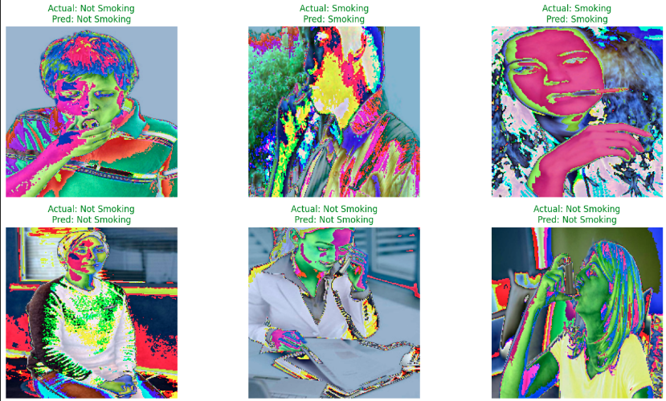

# Smoker Detection

The codes and examples can be found in [Smoker_detection.ipynb](https://github.com/bachPN73/Smoker-Detection/blob/main/Smoker_detection.ipynb).
## The Dataset
- Dataset link & Credit: [https://www.kaggle.com/datasets](https://www.kaggle.com/datasets/phamngocbach73/smoker-1k2)
- The dataset contains 1120 images divided equally into two classes, where 560 images are of Smoking (smokers) and remaining 560 images belong to NotSmoking (non-smokers) class
## Training

## Result
- Accuracy model: 0.92
  

